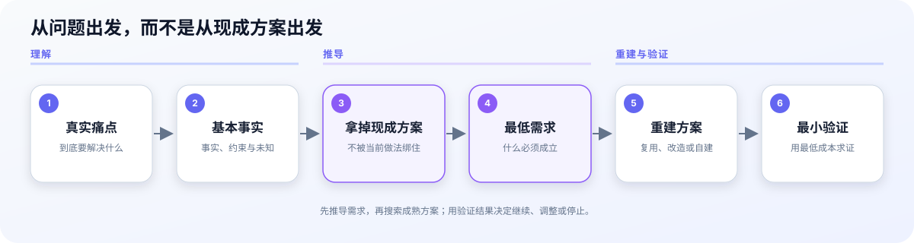

# 第一性原理 / First Principles

> 从真实痛点和基本事实重建可验证方案，而不是被现成做法牵着走。
>
> Rebuild decisions from real needs and basic facts instead of being trapped by the current solution.

[](https://github.com/try-suming/suming-first-principles/releases)
[](https://github.com/try-suming/suming-first-principles/commits/main)
[](LICENSE)



```bash
npx skills add try-suming/suming-first-principles
```

当前版本：0.3.2

## 你可以直接这样说

```text
$suming-first-principles 帮我判断，这两个学习 Skill 是否应该融合。
```

```text
$suming-first-principles 这个工具最近没用过，是否应该卸载？
```

```text
$suming-first-principles 拆解“工作流自动化”的本质、成立条件和边界。
```

## 30 秒理解

这个 Skill 不负责替你套一个“第一性原理模板”。它会先确认真正要解决的问题，区分事实、约束、决定、假设和未知；暂时拿掉当前方案，推导最低需求，再判断应该复用、改造还是重新构建，并给出成本相称的验证方式。

建设类问题只有在最低需求明确后，才检查本地和历史决定、官方原生能力、已安装插件或服务、GitHub 与真实案例。找到 1—3 个足够接近的候选后停止，不为了“找到最优”无限搜索。

## 使用前后有什么不同

| 原问题 | 使用后得到 |
|---|---|
| “这两个 Skill 要不要合并？” | 先检查职责冲突、真实使用障碍和合并代价，再判断保留、调整边界或合并 |
| “这个工具很少用，要不要卸载？” | 同时检查不可替代性、低频高后果价值和重新安装成本，不只看使用次数 |
| “GitHub 有没有更好的方案？” | 先推导最低需求，再比较少量接近候选，判断直接复用、最小改造或确有必要才自建 |

## 核心流程

```text
真实痛点 → 基本事实 → 拿掉现成方案 → 最低需求 → 重建方案 → 最小验证
```

保持现状不是默认答案。Skill 会同时考虑行动价值、探索价值、机会成本、失败代价和可逆性：低成本选择直接给最小试验，高成本且难回退的选择才升级反方检验或双向钢人。

## 输出

任务或方案默认给出：

- 真实目标；
- 底层事实与约束；
- 关键假设；
- 当前判断；
- 最小验证。

候选方案比较和双向钢人只在实际触发时出现，不机械填满固定模板。概念类继续输出一句话本质、成立条件、不适用边界和直观例子。

分析请求默认只读、不自动监控；用户已经授权实施时，收敛分析后由主代理继续执行和验证，不把退出本 Skill 当作结束任务。当前版本继续复用充分证据，并尊重用户明确指定的审阅范围。

## 边界

- 普通教学使用 `$suming-learn-explain`。
- 模糊产品或 MVP 访谈使用 `$suming-product-discovery`。
- 长对话整理按用户要求直接处理当前上下文。
- 今天是否做、是否跑偏和优先级安排交给 `$suming`。
- 单纯搜索、摘要、翻译和路径已明确的执行任务不调用本 Skill。

## 安装与验证

```bash
npx skills add try-suming/suming-first-principles
npx skills add try-suming/suming-first-principles --list
python3 /path/to/validate_skill.py .
```

### 前置条件

- [ ] 使用支持 Agent Skills 的宿主。
- [ ] 通过上述命令安装时，已安装 Node.js 与 `npx`。
- [ ] 已理解本 Skill 默认只分析；外部搜索和实际执行仍受宿主权限与用户授权约束。

现有报告覆盖结构、触发边界和输出案例；真实模型输出改善及跨宿主稳定性仍属于 missing evidence。

## Troubleshooting

| 问题 | 原因 | 解决 |
|---|---|---|
| 找不到 Skill | 安装目录或宿主扫描状态不一致 | 核对安装目录后刷新或重新打开 Codex |
| 没有自动调用 | 这是显式调用 Skill | 明确调用 `$suming-first-principles` 或要求使用第一性原理 |
| 回答总在劝退 | 只看到了风险，没有比较行动和探索价值 | 同时检查行动、探索、缩小试验与保持现状 |
| 搜索越来越长 | 没有执行候选停止条件 | 找到 1—3 个有效候选后停止 |
| 一直提问 | 没有在关键答案后收敛 | 每轮最多问一个会改变结论的问题，随后给出判断 |

## English Quick Start

`$suming-first-principles` is an explicit-invocation Agent Skill for rebuilding a task, system, decision, or concept from its real goal and basic facts.

It separates facts, constraints, decisions, assumptions, and unknowns; removes the current solution temporarily; derives minimum requirements; rebuilds viable options; and proposes a proportionate test. For tooling or automation decisions, it searches only after requirements are clear and stops after finding 1–3 comparable candidates.

Install:

```bash
npx skills add try-suming/suming-first-principles
```

Example:

```text
$suming-first-principles Should these two learning Skills be merged? Derive the real responsibility conflict before recommending a change.
```

The Skill is analysis-only by default. Search, file changes, publishing, and other external actions still require the permissions and authorization of the current task.

## 致谢

Upstream inspiration: suming-meta-skill: reusable skill packaging, trigger boundaries, and evidence-bound validation

## License

MIT
