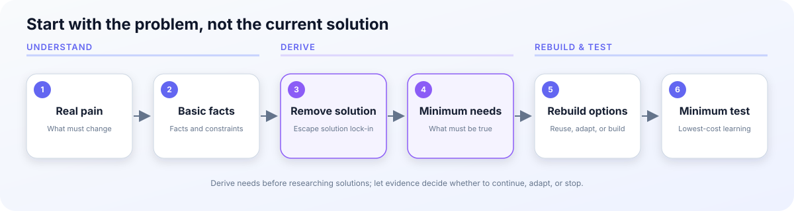

<p align="center">
  <a href="./README.md">简体中文</a> · <strong>English</strong>
</p>

<h1 align="center">First Principles</h1>

<p align="center">Rebuild decisions from real needs and basic facts instead of being trapped by the current solution.</p>

<p align="center">
  <a href="https://github.com/shilefumaoqu/suming-first-principles/releases"></a>
  <a href="https://github.com/shilefumaoqu/suming-first-principles/commits/main"></a>
  <a href="./LICENSE"></a>
</p>

<p align="center">
  <a href="#example">Example</a> · <a href="#install">Install</a> ·
  <a href="#core-flow">Core flow</a> · <a href="#boundaries">Boundaries</a>
</p>



```bash
npx skills add shilefumaoqu/suming-first-principles
```

Current version: 0.3.5

## Example

You ask:

```text
$suming-first-principles Should these two learning Skills be merged?
```

The Skill does not recommend a merge merely because their features look similar. It first checks:

- whether both Skills solve the same real problem;
- where users actually struggle to choose between them;
- whether a merge would blur invocation boundaries or add unnecessary context;
- whether clearer names or responsibilities would solve the issue without merging.

The result is a clear recommendation—keep, merge, reduce, or replace—with conditions and a minimum test, not a generic methodology report.

## Understand it in 30 seconds

This Skill does not mechanically apply a “first-principles template.” It identifies the real problem, separates facts, constraints, decisions, assumptions, and unknowns, temporarily removes the current solution, derives the minimum requirements, and then decides whether to reuse, adapt, or rebuild.

For tools, automation, or other build decisions, it searches only after the minimum requirements are clear. It stops after finding one to three comparable candidates instead of searching forever for a theoretical optimum.

## Try saying

```text
$suming-first-principles Should these two learning Skills be merged?
```

```text
$suming-first-principles I rarely use this tool. Should I uninstall it?
```

```text
$suming-first-principles Explain the essence, conditions, and limits of workflow automation.
```

## Before and after

| Initial question | What the Skill adds |
|---|---|
| “Should these two Skills be merged?” | Checks responsibility conflicts, real usage friction, and merge costs before recommending clearer boundaries or a merge |
| “I rarely use this tool. Should I remove it?” | Also checks irreplaceability, low-frequency high-impact value, and reinstall cost |
| “Is there a better solution on GitHub?” | Derives minimum requirements first, then compares a few close candidates for reuse, adaptation, or a justified custom build |

## Core flow

```text
Real pain → Basic facts → Remove the current solution → Minimum needs → Rebuild → Minimum test
```

Keeping the status quo is not the default. The Skill weighs action value, exploration value, opportunity cost, failure cost, and reversibility. Low-cost reversible choices get a small test; expensive or hard-to-reverse choices receive stronger counter-analysis.

## Output

A task or solution analysis usually contains the real goal, basic facts and constraints, key assumptions, the current recommendation, and a minimum validation step. Candidate comparisons and steelmanning appear only when they materially help.

## Install

```bash
npx skills add shilefumaoqu/suming-first-principles
npx skills add shilefumaoqu/suming-first-principles --list
python3 /path/to/validate_skill.py .
```

### Prerequisites

- [ ] An Agent Skills compatible host.
- [ ] Node.js and `npx` when using the installation command above.
- [ ] An understanding that analysis is read-only by default; search and execution still depend on host permissions and current-task authorization.

## Boundaries

- Use `$suming-learn-explain` for ordinary teaching.
- Use `$suming-product-discovery` for an open-ended product or MVP interview.
- Use `$suming` for current priorities, timing, and personal execution planning.
- Do not use this Skill for plain search, summarization, translation, or a mechanical task whose execution path is already clear.
- Analysis requests remain read-only. When implementation is already authorized, the main agent should conclude the analysis and continue the approved work.

## Verified and not yet proven

Verified: package structure, explicit invocation boundaries, public documentation, release workflow, and clean installation.

Not yet proven: that model outputs are universally better than ordinary analysis, that behavior is identical across every Agent Skills host, or that long-term use produces a fixed productivity gain.

## Troubleshooting

| Symptom | Likely cause | Fix |
|---|---|---|
| The Skill is not listed | Installation path or host discovery state differs | Check the installation path, then refresh or reopen the host |
| It does not trigger automatically | This is an explicit-invocation Skill | Invoke `$suming-first-principles` or explicitly request first-principles reasoning |
| Every answer recommends doing nothing | Risks were considered without action or exploration value | Compare action, exploration, a smaller test, and the status quo |
| Research keeps expanding | The candidate stopping rule was not applied | Stop after one to three useful comparable candidates |
| It keeps asking questions | The analysis did not converge after the key unknown | Ask at most one conclusion-changing question, then recommend |

## Acknowledgments

Upstream inspiration: suming-meta-skill: reusable skill packaging, trigger boundaries, and evidence-bound validation

## License

MIT
